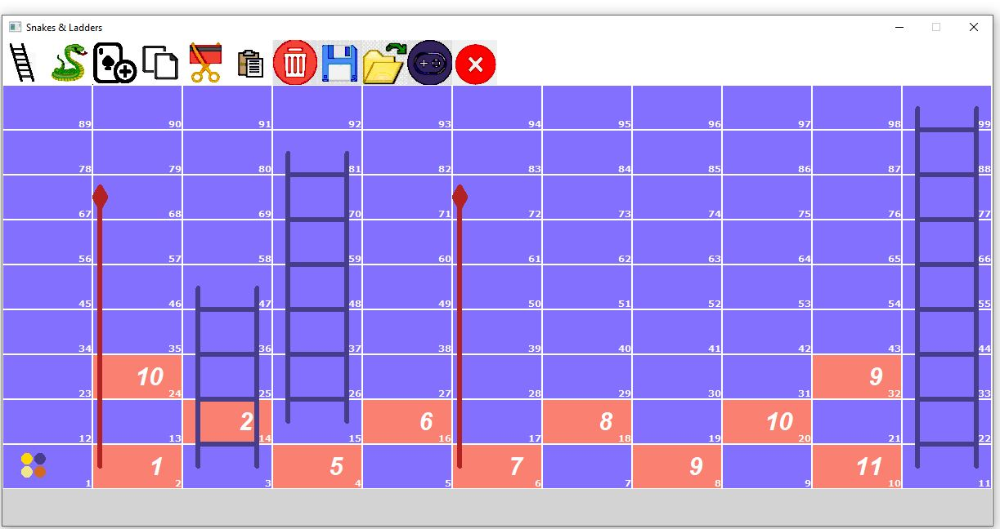
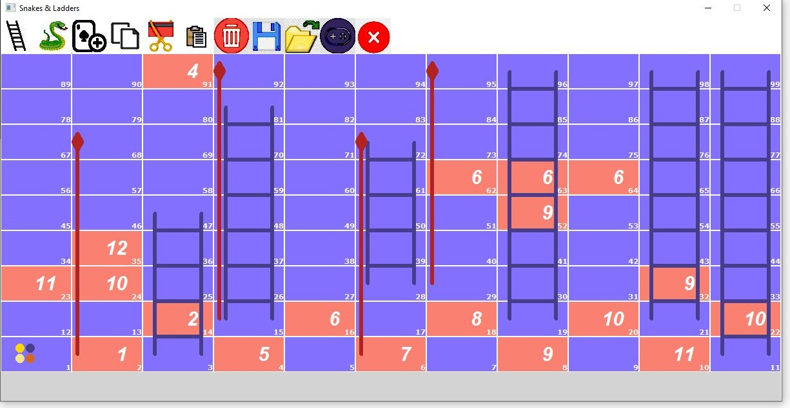

# Snakes & Ladders with a board editor (C++)

A four-player Snakes & Ladders game with Monopoly-style cards and a built-in board editor, in C++ on Windows. Team project for *Programming Techniques* (CMPN101) at Cairo University, spring 2023, by Amr Ashraf, Karim Negm, Mohamed Tarek Alhabashi and Omar Osama. Built on the course's starter skeleton and the CMUgraphics library.

## Two modes

**Design mode** is the editor. Click to place ladders, snakes and cards on the 99-cell board; copy, cut, paste and delete objects; save the board to a text file and load it back. Overlapping ladders or snakes are rejected.

**Play mode** runs the game. Four players take turns rolling the dice (or entering a value, for testing), each with a wallet of coins. Landing on a ladder, snake or card applies it, and effects chain: a card that moves you onto a snake sends you down it.

## Cards and power-ups

| Card | Effect |
|---|---|
| 1 | Lose a set number of coins |
| 2 | Jump to the next ladder |
| 3 | Extra dice roll |
| 4 | Skip your next turn |
| 5 | Move back as many cells as you rolled |
| 6 | Move to a cell chosen when the card was placed |
| 7 | Send the next player back to the start |
| 8 | Prison: pay to get out or stay |
| 9, 10, 11 | Stations: buy them, and other players pay you a fee for landing there |
| 12 | Your most expensive station goes to the player with the fewest coins |

Power-ups a player can use on their turn: **Lightening** (every other player loses 20 coins), **Fire** (burn a chosen player for 3 turns), **Poison** (5 turns) and **Ice** (the target skips a turn).

## Design

Every user action is a class derived from `Action` (`AddLadderAction`, `RollDiceAction`, `SaveGridAction`, ...), created and executed by the `ApplicationManager`. Ladders, snakes and the twelve cards derive from `GameObject`, so the `Grid` applies whatever sits on a cell through one virtual `Apply` call. `Input` and `Output` wrap all drawing and mouse and keyboard handling. About 5,500 lines.

## Who did what

| | |
|---|---|
| Karim Negm | Play-mode actions (roll dice, input dice value, new game), saving and loading boards, switching to play mode, deleting objects, optimisation |
| Amr Ashraf | Adding ladders, snakes and cards; copy, cut and paste; cards 1, 6, 7 |
| Mohamed Tarek Alhabashi | Cards 3, 4, 5, 8, 12; Lightening, Fire and Poison |
| Omar Osama | Cards 2, 9, 10, 11; player movement; Ice; optimisation |

## Build and run

Open `game/PT-Project.sln` in Visual Studio on Windows and run. The game loads its toolbar icons from `game/images/` and its boards from `Sample_Grids/`. In design mode, click the open icon and type `chaos`, `chaos2` or `chaos3` to load a sample board.

`game/CMUgraphicsLib/` is the third-party graphics library supplied with the course.
